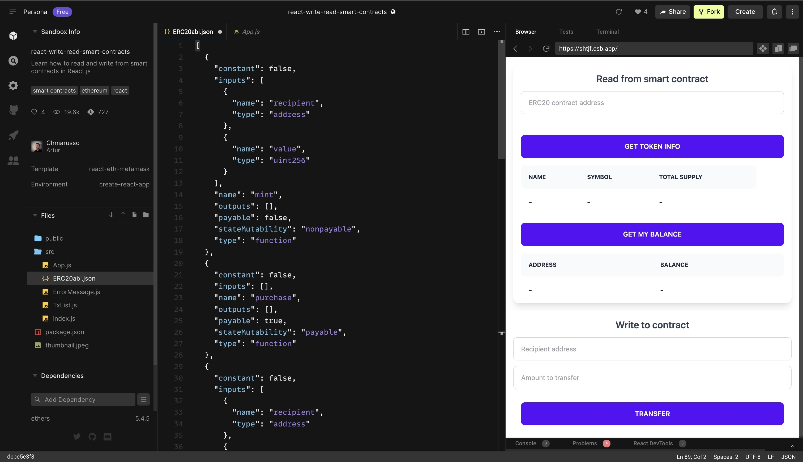
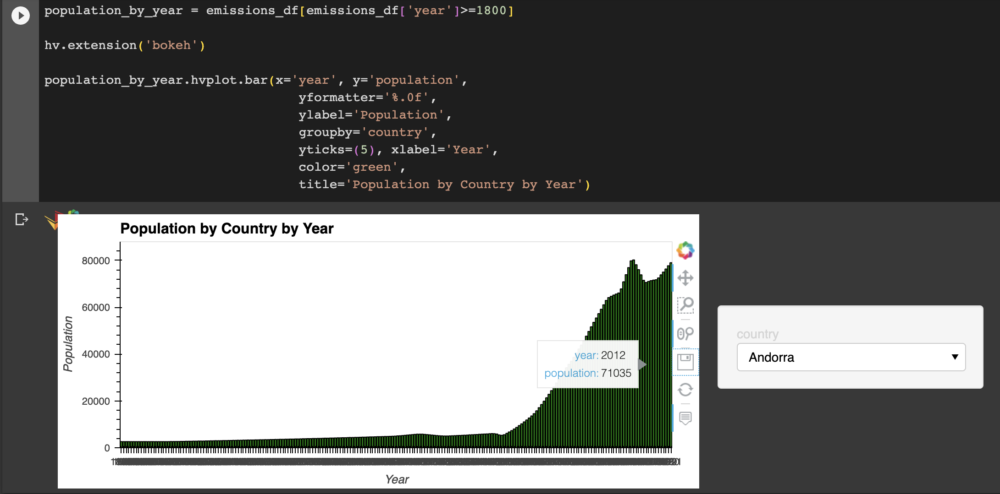
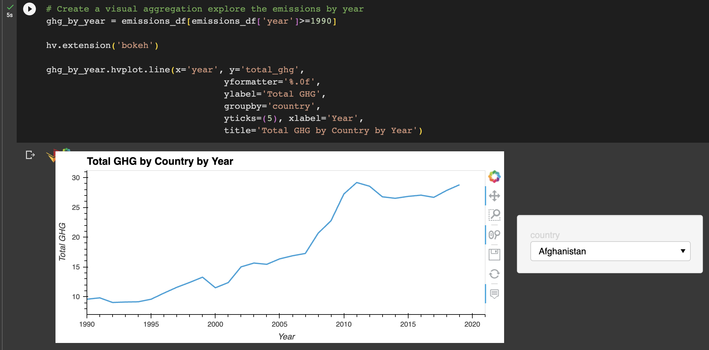
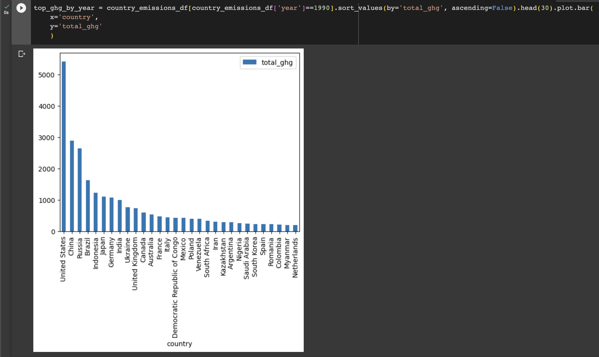
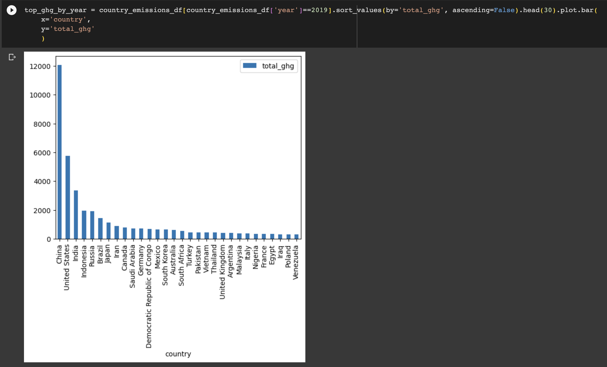
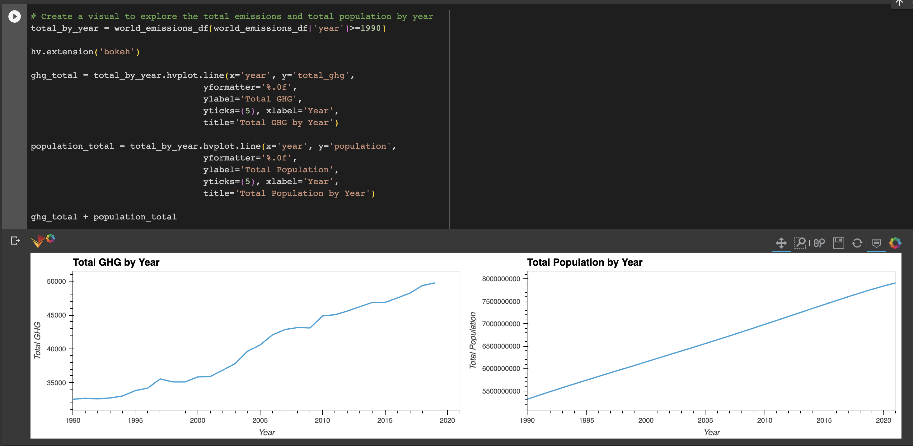
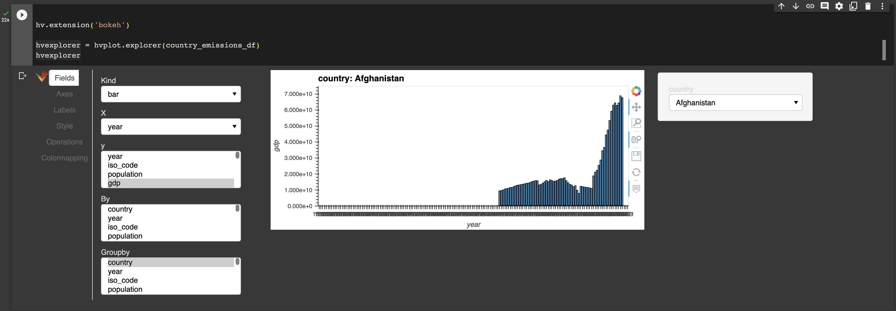

# Group_5_Project #
## Carbon Neutral Token ##

TerraCarbon is a platform that facilitates carbon credit trading, allowing buyers and sellers to interact and contribute to the goal of improving the planet. Our platform introduces a fungible token that serves as the currency for carbon credit trade.

## Procedure ##

* Create a Jupyter Notebook using pandas and APIs to identify users and their carbon emissions.
* Define token specifications: Name, symbol, total supply, and decimal places.
* Write a smart contract with basic ERC-20 token functions (transfer, approve, balanceOf).
* Deploy the smart contract on Ethereum using Remix IDE.
* Develop a user interface with React to enable users to interact with the smart contract and trade carbon credits.
* Create a decentralized exchange (DEX) on the blockchain for carbon credit trading using the token.
* Interact with the deployed smart contract to transfer and withdraw funds.
* Produce a video demonstrating the entire process.

## Why is this important? ##

Trading carbon credits with our own token offers several advantages over traditional methods:

- Lower Transaction Costs: By using your own tokens, you can avoid the transaction fees charged by third-party intermediaries such as banks or exchanges. This can significantly reduce the cost of trading and make it more accessible for smaller investors.
- Faster Settlement: Traditional carbon credit trading can take several days to settle, while using tokens can enable near-instant settlement, making the process faster and more efficient.
- Increased Transparency: Tokens are built on blockchain technology, which provides a tamper-proof ledger that can be easily audited. This can increase transparency in the trading process and help to prevent fraud.
- Improved Liquidity: Tokens can be traded 24/7, which can increase liquidity and make it easier to buy and sell carbon credits.
- More Accessible: By using tokens, carbon credit trading can become more accessible to a wider range of investors, including those in countries where traditional financial systems are not well-established.
- It's important to note that using your own tokens for carbon credit trading may also have some disadvantages, such as the potential for price volatility and the need to ensure that the tokens comply with regulatory requirements. However, with proper planning and execution, using tokens can be a viable option for carbon credit trading.

## ELON INTRODUCTION SCRIPT ##

Hello FinTech Students,

Carbon credits are a fascinating concept that have the potential to help us reduce our carbon footprint and slow down climate change. In simple terms, carbon credits are like a currency that companies can use to offset their carbon emissions. 

Now, some people may argue that carbon credits are just a way for companies to continue emitting greenhouse gases without actually reducing their emissions. And to some extent, they're right. Carbon credits are not a silver bullet solution to climate change, but they can play a role in incentivizing companies to invest in sustainable practices and technologies.
At Tesla, we've always been committed to reducing our carbon footprint, which is why we focus on developing and producing electric vehicles and renewable energy products that can help decarbonize the transportation and energy sectors.

The ultimate goal should be a zero-emissions economy where carbon credits are no longer needed. And that's what we're working towards at Tesla, SpaceX and The Boring Company. We believe that we can make a significant impact on reducing emissions by developing and scaling sustainable technologies, and we hope that others will join us in this effort.

Carbon credits can be a useful tool in the fight against climate change, but they're not the full solution. We need to keep pushing for innovative and sustainable solutions on our way to a zero-emissions future.

Now, I’d like to pass it over to my good friends, Norman, Jenn, Rei, Moh and Sujatha to talk more about Carbon Credits and the Smart Contract system they’ve created…

](https://www.youtube.com/watch?v=rEMYKjlyqEk)

## Smart Contract and ERC Standard ##

We created a smart contract using remix IDE with the function to mint, transfer, exchange, purchase and check the symbol of our TerraCarbon token

We used ERC 20 standard for minting our token as ERC 20 is the standard for tokens that fungible on the Ethereum Network. We consider our token to be fungible
becuase each TerraCarbon credit is no different from any other TerraCarbon credit and it can be divided depending on how much you want to buy in the market.
Each TerraCarbon has a price the is dictated by the market, so depending on the demand between buyers and sellers the market gives a clear price for each unit
of TerraCarbon. 

We then used metamask to interact with our Smart Contract and we were able to link metamask with our smart contract in solidity

Here we can see the creaton of our smart contract and confirm our transaction in Ganache

We can use our metamask with our smart contract to interact with the block chain and execute transactions

We can also see here in our Ganahce that we were able to mine multiple blocks using our smart contract

## User Interface ## 

To allow for a seamless interaction with the deployed ERC-20 smart contract, we use React.js. It leverages the useState and useEffect hooks to manage state and perform various actions. This component empowers users by enabling them to input the address of an ERC-20 contract and retrieve essential information like the token's name, symbol, and total supply. Users can also check their account balance of their TerraCarbon tokens and even transfer them to another address.

## Conclusion ## 

In the Carbon Neutral Token project, we have developed a platform for carbon credit trading using our fungible token called TerraCarbon. We started by creating a Jupyter notebook to identify users' carbon emissions. Then, we defined the specifications of our token, including its name, symbol, total supply, and decimal places. We wrote a smart contract using the ERC-20 token standard and deployed it on the Ethereum blockchain using Remix IDE. To enable users to interact with the smart contract, we created a user interface using React.js. In the future, the Carbon Neutral Token project has the potential for market adoption, integration with carbon offset projects, expansion to other blockchain platforms and an enhanced user experience. By pursuing these directions, the Carbon Neutral Token project can continue to contribute to global efforts in mitigating climate change and promoting sustainability.

## BACKGROUND ##

Beginning our project, we wanted to provide some background information on why Carbon Credits are something to be knowledgable about.  We started by using Python to create some graphs on emissions and the population world-wide as well as by country.

The resulting graphs show the increasing population and emissions throughout the world.  

Using this graph, we can review the population increases in every country in the world since 1800.  We used the groupby function to make the graph customizable in the file.

Using this graph, we can review the total GHG increases in every country in the world since 1990.  We used the groupby function to make the graph customizable in the file.

To zoom in on certain countries that are the major contributors to greenhouse emisisons, we looked at the top 30 countires in 1990 and again in 2019.

You can also reveiw the total World Population and the World GHG Emissions by reviewing the next couple graphs.

While reseaching the graphs, we used another hvplot function that we did not review in class.  By using the "hvplot.explorer" function, we can take the entire DataFrame and easily review and customize what we would like to see.  This allows you to customize all inputs to the graphs and quickly change the inputs and chart types.

## SOURCES
Carbon Footprint API - https://rapidapi.com/carbonandmore-carbonandmore-default/api/carbonfootprint1

Hannah Ritchie, Max Roser and Pablo Rosado (2020) - "CO₂ and Greenhouse Gas Emissions". Published online at OurWorldInData.org. Retrieved from: 'https://ourworldindata.org/co2-and-greenhouse-gas-emissions' [Online Resource]

D-id for Elon Musk Animation - https://www.d-id.com/?utm_term=d-id&utm_campaign=Brand&utm_source=adwords&utm_medium=ppc&hsa_acc=6149207258&hsa_cam=17780208183&hsa_grp=141566902480&hsa_ad=634015141111&hsa_src=g&hsa_tgt=kwd-369030435047&hsa_kw=d-id&hsa_mt=p&hsa_net=adwords&hsa_ver=3&gad=1&gclid=Cj0KCQjwsIejBhDOARIsANYqkD2FT7uHnYIcU7DzPUd8nPzSrVpN7gz-ZL8j9TZrehGsBuGs6iqvpcgaAu1dEALw_wcB

11ElevenLabs for Voice Generator - https://beta.elevenlabs.io/speech-synthesis

Veed.io for subtitles - https://www.veed.io/

